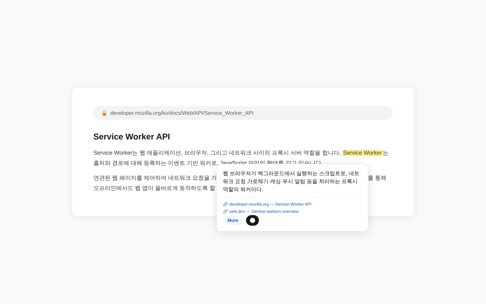
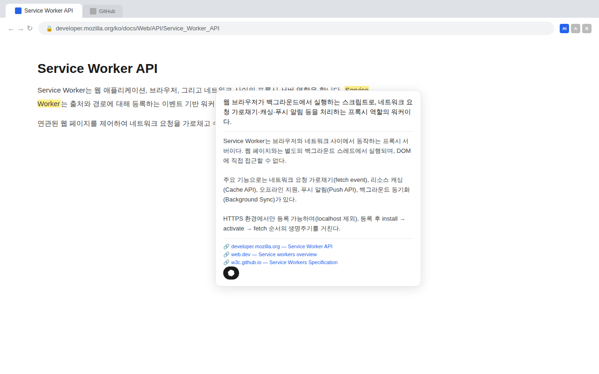
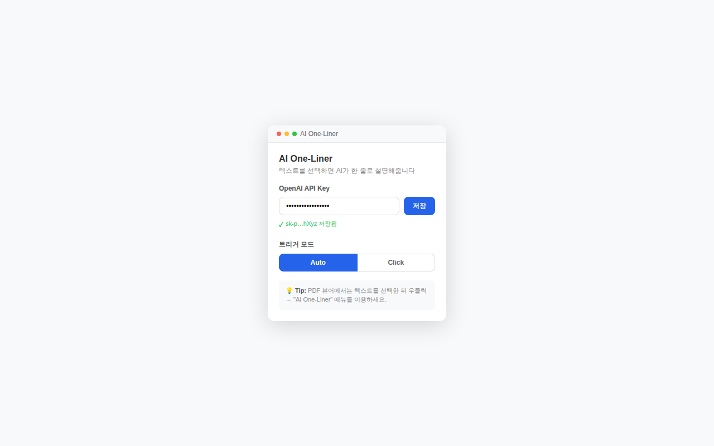

<div align="center">

# AI One-Liner

**드래그 한 번이면, AI가 한 줄로 설명해줍니다.**

[](https://chromewebstore.google.com/detail/ai-one-liner/anahkhnbkeledcffgiancenokfkdkpmf)
[](#)
[](#license)
[](#)

<br />



<br />

</div>

---

## Why?

웹 서핑 중 모르는 용어가 나올 때마다 새 탭을 열고 검색하는 건 번거롭습니다.

**AI One-Liner**는 텍스트를 드래그하는 것만으로 그 자리에서 바로 AI 설명을 보여줍니다. 검색 → 탭 전환 → 다시 돌아오기, 이 흐름을 끊지 않습니다.

<br />

## Features

| | 기능 | 설명 |
|---|---|---|
| **1** | 한 줄 설명 | 드래그 즉시 핵심만 담은 1문장 요약 |
| **2** | 상세 설명 | `More` 버튼으로 3~4줄 심화 설명 확장 |
| **3** | 출처 링크 | 웹 검색 기반 팩트 체크 + 원본 소스 표시 |
| **4** | AI 바로가기 | ChatGPT · Claude · Gemini · Grok · Perplexity 원클릭 |
| **5** | 트리거 모드 | Auto (즉시) / Click (클릭 시) 전환 |
| **6** | 히스토리 | 이전/다음 검색 기록 탐색 |
| **7** | PDF 지원 | 우클릭 컨텍스트 메뉴로 PDF 뷰어에서도 사용 |
| **8** | 키보드 | `Shift+방향키` 선택, `A` 트리거, `ESC` 닫기 |

<br />

<details>
<summary><strong>스크린샷 더보기</strong></summary>

<br />

| 상세 설명 | 설정 화면 |
|:---:|:---:|
|  |  |

</details>

<br />

## Quick Start

### 1. 설치

[Chrome 웹 스토어](https://chromewebstore.google.com/detail/ai-one-liner/anahkhnbkeledcffgiancenokfkdkpmf)에서 **AI One-Liner**를 설치하세요.

### 2. API Key 설정

1. [OpenAI API Keys](https://platform.openai.com/api-keys)에서 키 발급
2. 확장 아이콘 클릭 → API Key 입력 → **저장**

### 3. 사용

아무 웹페이지에서 텍스트를 **드래그**하면 끝.

<br />

## How It Works

```
텍스트 선택 → Content Script 감지 → Background Service Worker
                                          ↓
                                    OpenAI API (gpt-4.1-mini)
                                    + Web Search Tool
                                          ↓
                                    한 줄 설명 + 출처
                                          ↓
                                    Shadow DOM 툴팁 렌더링
```

- **Manifest V3** — 최신 Chrome Extension 표준
- **Shadow DOM** — 호스트 페이지 CSS와 완전 격리
- **Zero Server** — 자체 서버 없음, API Key는 브라우저 로컬에만 저장

<br />

## Tech Stack

```
Chrome Extension (Manifest V3)
├── Background    Service Worker + OpenAI Responses API
├── Content       Selection Detection + Shadow DOM Tooltip
├── Popup         Settings UI (API Key, Trigger Mode)
└── Tools         Playwright (Screenshots)
```

<br />

## Project Structure

```
ai-one-liner/
├── manifest.json          # 확장 설정
├── background/
│   └── background.js      # Service Worker — API 호출, 컨텍스트 메뉴
├── content/
│   ├── content.js         # 텍스트 선택 감지, 툴팁 UI
│   └── content.css        # 호스트 페이지 스타일 격리
├── popup/
│   ├── popup.html         # 설정 UI
│   ├── popup.js           # API Key, 트리거 모드 관리
│   └── popup.css          # 팝업 스타일
├── icons/                 # 16 / 48 / 128px 아이콘
├── store/                 # 웹스토어 스크린샷, 등록 정보
├── scripts/               # Playwright 스크린샷 스크립트
└── docs/                  # 기획, 설계, 분석 문서
```

<br />

## Privacy

- 사용자가 선택한 텍스트만 OpenAI API로 전송됩니다
- API Key는 브라우저 `chrome.storage.sync`에만 저장됩니다
- 자체 서버를 운영하지 않으며, 어떤 데이터도 수집하지 않습니다

전체 내용은 [개인정보 처리방침](PRIVACY_POLICY.md)을 참고하세요.

<br />

## License

MIT &copy; 2026 [shqkel](https://github.com/shqkel)
